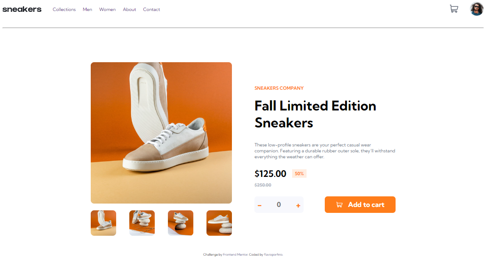
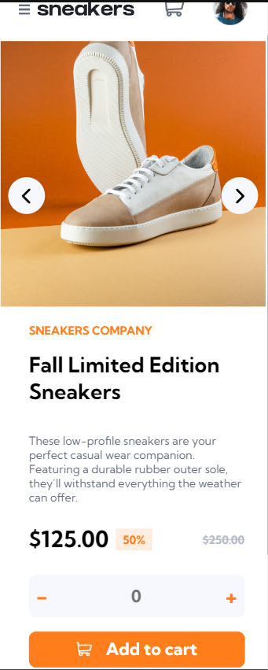

# Frontend Mentor - E-commerce product page solution

This is a solution to the [E-commerce product page challenge on Frontend Mentor](https://www.frontendmentor.io/challenges/ecommerce-product-page-UPsZ9MJp6). Frontend Mentor challenges help you improve your coding skills by building realistic projects.

## Table of contents

- [Overview](#overview)
- [The challenge](#the-challenge)
- [Links](#links)
- [Built with](#built-with)
- [Author](#author)

## Overview

### The challenge

Users should be able to:

- View the optimal layout for the site depending on their device's screen size
- See hover states for all interactive elements on the page
- Open a lightbox gallery by clicking on the large product image
- Switch the large product image by clicking on the small thumbnail images
- Add items to the cart
- View the cart and remove items from it

### Links

- Solution URL: [Site](https://flavioporfirio.github.io/frontend-mentor/ecommerce-product-page-main/)

### Built with

- Semantic HTML5 markup
- CSS
- [Javascript](https://www.javascript.com)

## Author

- Frontend Mentor - [@flavioporfirio](https://www.frontendmentor.io/profile/flavioporfirio)
- Instagram - [flavioporfirio86](https://www.instagram.com/flavioporfirio86/)
